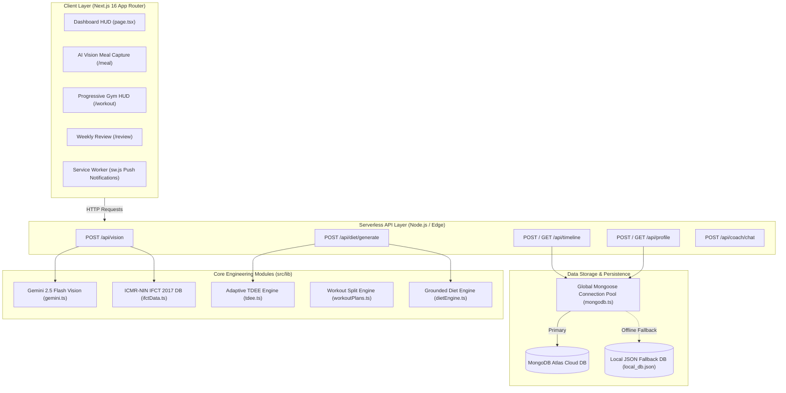
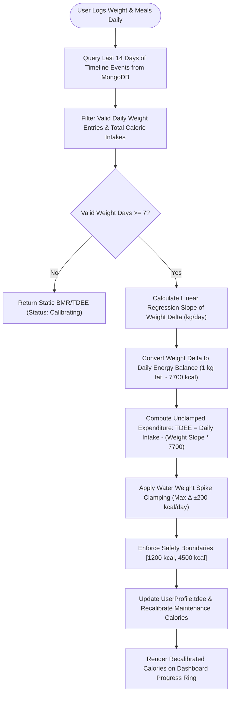
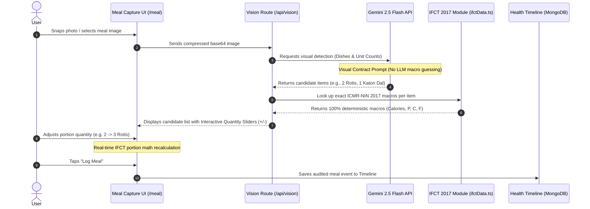
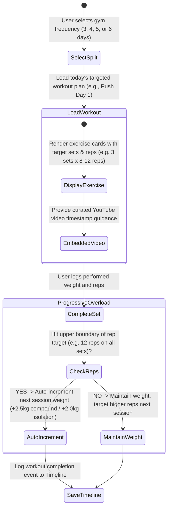

# Health OS Architecture & Engineering Specification 🏛️

This document outlines the system architecture, mathematical algorithms, data pipeline models, and security principles powering **Health OS**.

---

## 📐 System Overview Diagrams

### Diagram 1: High-Level System Architecture & Data Pipelines

---

### Diagram 2: 14-Day Rolling Linear Regression Adaptive TDEE Loop (MacroFactor Paradigm)

---

### Diagram 3: 4-Stage Perfect Vision & ICMR-NIN IFCT 2017 Portion Engine

---

### Diagram 4: Grounded AI Diet Allocation & Math Audit Pipeline

```mermaid
flowchart LR
    subgraph Allocator ["1. Pre-Calculation Math"]
        DailyTarget["Daily Targets (e.g. 2200 kcal, 150g P)"] --> MPSAlloc["MPS Leucine Allocation (25% B / 30% L / 15% S / 30% D)"]
        MPSAlloc --> AdditionsCalc["Calculate Required Additions (Whey, Eggs, Paneer)"]
    end

    subgraph Prompt ["2. Grounded LLM Contract"]
        AdditionsCalc --> GeminiPrompt["Inject Exact Macro Parentheses Contract into Gemini"]
        GeminiPrompt --> GeneratePlan["Gemini Generates Natural Meal Rationale & Timing"]
    end

    subgraph Audit ["3. Programmatic Math Audit"]
        GeneratePlan --> ParseJSON["Parse Response JSON"]
        ParseJSON --> AuditMath["auditAndFixDietPlanMath() (Re-sum item macros in TypeScript)"]
        AuditMath --> FixHallucinations["Override LLM Arithmetic Errors (0% Error Rate)"]
    end

    FixHallucinations --> SaveDB[("Save Verified Diet Plan to User Profile")]
```

---

### Diagram 5: Double Progression Workout & Progressive Overload Engine

---

## 🗄️ Database Schemas & Data Models

### 1. `UserProfile` Schema (`src/lib/db/models.ts`)
Stores identity, physical biometrics, calculated TDEE, mess menu configurations, and generated diet plans.

Key Compound Indexes:
- `{ email: 1 }` (Unique Index)

### 2. `TimelineEvent` Schema (`src/lib/db/models.ts`)
Central event log storing all user health activities (meals, workouts, weights, sleep, water).

Key Compound Indexes:
- `{ userId: 1, timestamp: -1 }` (Fast chronological timeline rendering)
- `{ userId: 1, type: 1, timestamp: -1 }` (Filtered type queries for TDEE regression & weekly reviews)

---

## 🔌 Serverless Connection Pooling & Offline Resilience

Health OS uses a **dual-layer database connection manager** (`src/lib/mongodb.ts` & `src/lib/db/fallback.ts`):
1. **Primary Layer**: `connectDB()` attaches the Mongoose connection promise to `global._mongooseCache` to prevent connection pool exhaustion across serverless cold starts.
2. **Offline Fallback Layer**: If MongoDB Atlas is unreachable, the system gracefully falls back to local JSON file persistence (`local_db.json`), ensuring uninterrupted user experience.
