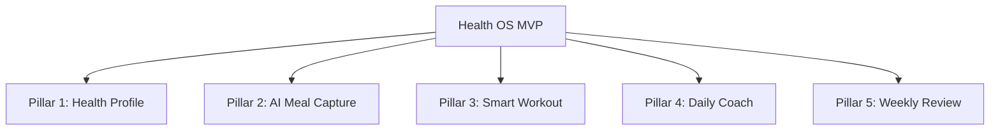

# Product Constitution & Specification: Health OS (Internal Codename)

This document establishes the foundational vision, non-negotiable principles, user psychology, technical architecture, and database philosophy for the Health OS platform. It is derived from the comprehensive 20-phase product discovery research.

---

## 1. Product Vision & Mission

> [!IMPORTANT]
> **Vision Statement**
> Build the world's most intelligent personal health operating system that minimizes manual tracking while maximizing personalized guidance.

### The Mission
To help people make better decisions about themselves by turning raw health data into personalized, trustworthy guidance. The app is not a diary; it is a **decision engine**.

---

## 2. Core Philosophy: The Health OS Model

Current fitness apps treat the user like a database input clerk:
$$\text{User} \longrightarrow \text{Inputs Data} \longrightarrow \text{App Stores Data} \longrightarrow \text{App Shows Charts}$$
Under this old model, the user does all the thinking.

The **Health OS Model** reverses this:
$$\text{User} \longrightarrow \text{Lives Life} \longrightarrow \text{App Understands Life} \longrightarrow \text{App Gives Decisions}$$
The software thinks for the user, while keeping them informed and in control.

---

## 3. The 11 Product Principles (Locked In)

1. **Every feature must reduce effort.** If a feature increases manual work, it must not exist.
2. **Every screen must answer one question.** Do not try to show multiple dashboards or dump numbers.
3. **Every recommendation must explain why.** Transparency builds trust.
4. **The AI should think before the user asks.** Proactive intelligence, not chat-first Q&A.
5. **The product should become more valuable every month.** It accumulates years of personalized health memory.
6. **Typing is a failure.** Capture must be automatic or camera-based whenever possible.
7. **The app should save time, not consume it.** The target is less than 1 minute of daily interaction.
8. **Every screen should reduce cognitive load.** Just make the next best decision obvious.
9. **Data is the asset. AI is the interpreter.** Swapping LLM models is easy; recreating years of structured user memory is impossible.
10. **Every feature must have a measurable reason to exist.** It must solve a user problem, have a success metric, and be better than existing solutions.
11. **Simplicity is a competitive advantage.** Every feature must pass the "Final Feature Filter."

---

## 4. The 5 Core Pillars (MVP Scope)



### Pillar 1: Health Profile
* Created once: Age, Height, Weight, Gender, Goal, Activity Level, Gym Experience, Diet Preference, Food Allergies, Medical Conditions, Sleep/College Schedule.

### Pillar 2: AI Meal Capture
* Camera-first. Point camera $\rightarrow$ AI detects foods $\rightarrow$ user confirms/adjusts via one-tap portion estimation (Small/Medium/Large) $\rightarrow$ meal saved (under 10 seconds).
* **Aditya AI**: Learns regional Indian dishes, mess food menu, and individual plates/serving sizes over time to autocomplete meals.

### Pillar 3: Smart Workout
* Simplicity-first. Open app $\rightarrow$ see today's workout, exercises, previous weights/reps, and suggested progression (progressive overload automatic). No manual workout builders.

### Pillar 4: Daily Coach
* A single, living "Command Center" card.
* Displays today's mission (e.g., complete Push Workout, hit protein, steps, sleep target).
* Provides an actionable, contextual recommendation (e.g., "Sleep was only 5h. Reduce today's volume by 20%").

### Pillar 5: Weekly Review
* Every Sunday. Interactive, "Spotify Wrapped"-style review of weight trend, calories, protein, strength, photos, recovery, and coach summary. No manual reporting.

---

## 5. Technical Architecture & System Design

```
+--------------------------------------------------------+
|                      Client                            |
+--------------------------------------------------------+
                           |
                           v
+--------------------------------------------------------+
|                     API Layer                          |
+--------------------------------------------------------+
                           |
                           v
+--------------------------------------------------------+
|             Health Intelligence Layer                  |
+--------------------------------------------------------+
      |                    |                    |
      v                    v                    v
+------------+       +-----------+        +-------------+
| Data Layer |       | AI Layer  |        | Storage     |
+------------+       +-----------+        +-------------+
```

### Core Architecture Rules
1. **AI is infrastructure, not a feature.** It lives beside the data layer and storage, not on top of it.
2. **Every piece of data exists only once.**
3. **Use software for certainty; use AI for uncertainty.** All math (calories remaining, BMI, sums, volume) stays in deterministic code. AI is reserved for interpretation, reasoning, and personalization.
4. **Offline-First.** Gym basements and hostels have poor connectivity. All logs (workouts, food, weights, photos) store locally and sync later.
5. **AI Context Builder.** Instead of sending the entire database to the LLM, the analytics engine calculates context summaries (e.g., 14-day averages, weight trends) and sends only the relevant context.

### The Five Engines
* **Engine 1: Health Engine**: Stores weight, body measurements, photos, goals, medical data, and body composition.
* **Engine 2: Nutrition Engine**: Handles meals, recipes, macros/micros, calories, Indian/mess food datasets, and database mappings.
* **Engine 3: Training Engine**: Manages exercises, programs, progressive overload rules, workout history, PRs, and volume.
* **Engine 4: AI Engine**: Handles computer vision, reasoning, memory, recommendations, and natural language.
* **Engine 5: Analytics Engine**: Non-AI calculations for charts, trends, and weekly/monthly reviews.

### Database Philosophy: The Health Timeline
* **The center of the database is the Health Timeline, not the user.**
* Everything is stored as chronological events on a single timeline rather than isolated, disconnected tables:
  $$\text{Timestamp} \longrightarrow \text{Event Type (Weight/Meal/Workout/Sleep)} \longrightarrow \text{Event Payload}$$
* This allows the AI to reason across temporal dimensions and connect disparate events (e.g., how a college exam week affects sleep, which in turn degrades training performance and increases recovery requirements).

---

## 6. The AI Memory System

AI memory is structured as **Knowledge**, not chat history. It is divided into 4 layers:

| Layer | Scope | Key Data Points |
| :--- | :--- | :--- |
| **Layer 1** | Current Day | Everything happening today (meals, workouts, steps, recovery score). |
| **Layer 2** | Current Week | Weekly calorie balance, protein target progress, current workout routine. |
| **Layer 3** | Current Month | Weight trends, body measurements, personal records (PRs). |
| **Layer 4** | Long-Term | Injuries, preferences, behavioral patterns, exam schedules, vacations, favorite meals. |

---

## 7. UX & Emotional Design Philosophy

* **Time to Confidence**: The primary North Star metric. The user should open the app and confidently understand: *"Am I on track?"* and *"What do I do next?"* in under 10 seconds.
* **No Guilt / Missed Workouts**: When a user returns after missing days, show: *"Welcome back. Let's focus on today. That's all that matters."* Avoid red warnings or guilt-inducing alerts.
* **The 80/20 Rule**: 20% of features generate 80% of value. Keep the UI extremely clean by hiding settings, social feeds, and badge walls.
* **The Three Taps Rule**: Any common task (log meal, complete set, log weight) must be completed in a maximum of three taps.
