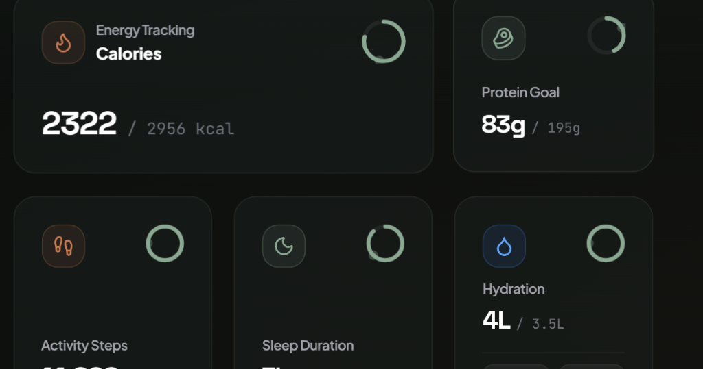
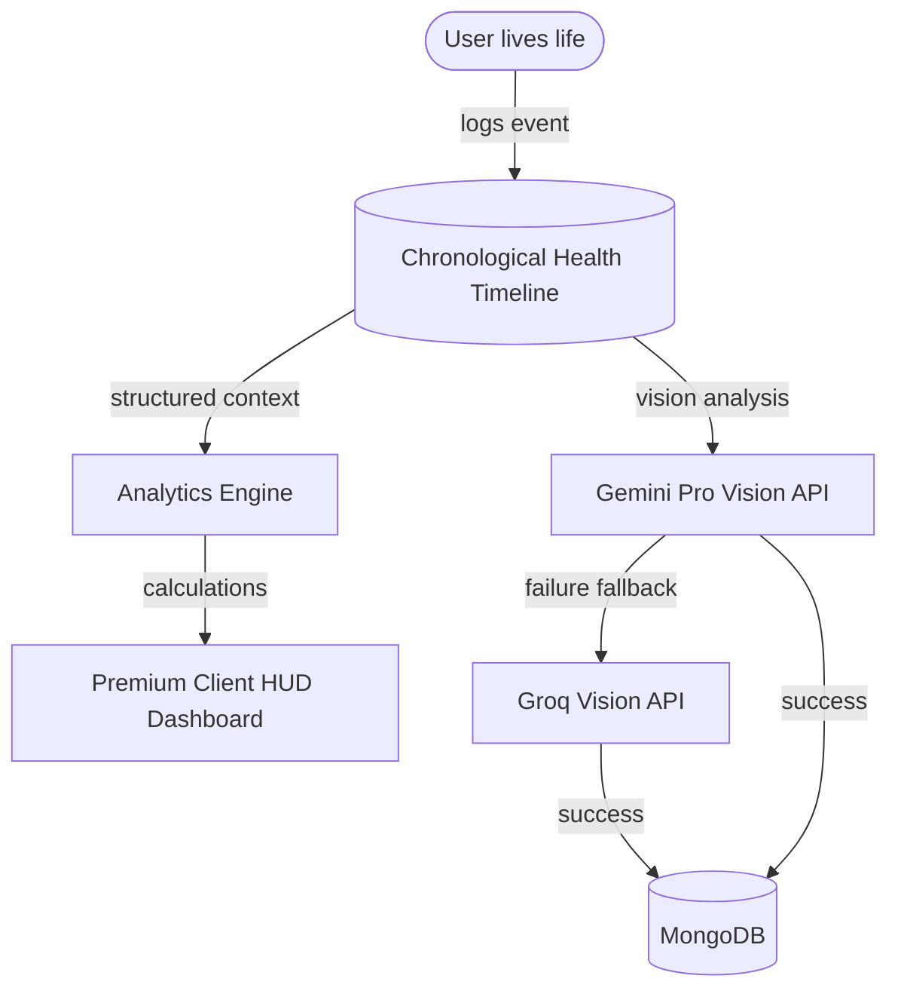
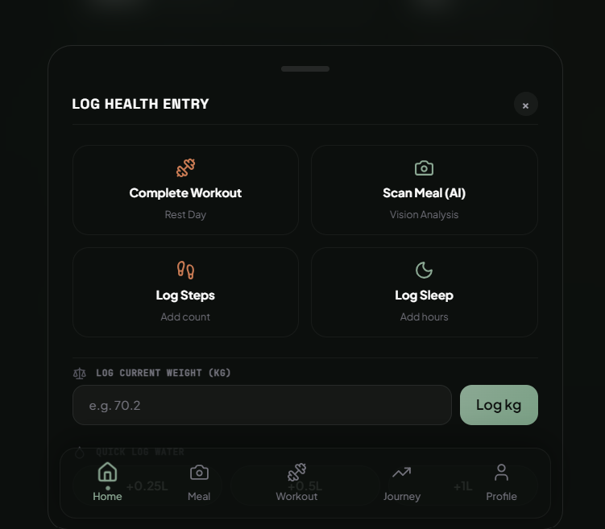
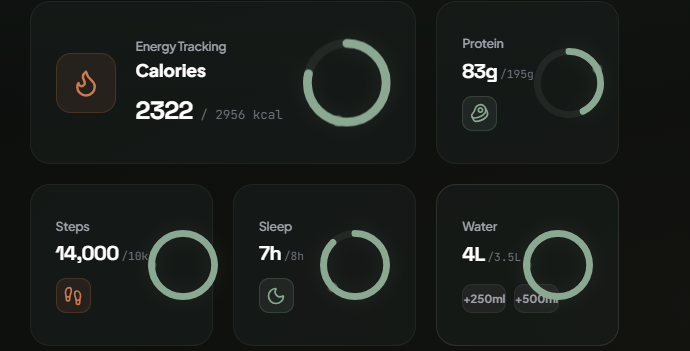

# Health OS 🟢

> The world's most intelligent personal health operating system. Reversing the paradigm from manual tracking diary to an automated decision engine.



---

## 🎨 Tech Stack & Architecture

Health OS is designed with a premium, glassmorphic HUD style, high contrast dark theme, and micro-interactions powered by a modern frontend and backend infrastructure:

- **Frontend Framework:** Next.js (App Router, Tailwind CSS, TypeScript)
- **Database Layer:** MongoDB (via Mongoose) with a central **Health Timeline** architecture
- **Animations:** Framer Motion for premium micro-motion & smooth transitions
- **Aesthetic Assets:** Lucide React icons, curated HSL color palette
- **AI Infrastructure:** Gemini Pro Vision (primary analyzer) & Groq Vision (fallback)

### System Flow Diagram


---

## 🚀 Core Features

### 1. Daily HUD Dashboard

- **Progress Ring:** Rotating progress indicator with a mathematically-mapped tip glow dot to guide target calories and workout status.
- **Glassmorphism:** Frosted-glass design system built from scratch using vanilla CSS and Tailwind utilities.
- **Command Center Card:** A single card showing today's main targets (steps, sleep, workout splits).

### 2. AI Meal Capture (Gemini-First Vision Fallback Sequence)

- **Computer Vision:** Points camera at meals to detect food items.
- **Intelligent Fallback Chain:**
  1. Calls **Gemini Vision** first for primary food detection and macro calculation.
  2. Falls back to **Groq Vision** if Gemini is rate-limited or fails.
  3. Falls back to highly calibrated mock local parser if network connections are lost.

### 3. Gym Split & Workout Engine
- Automatically updates, logs, and guides gym progression rules.
- Supports dynamic 5-day splits (updated from 4 to 5 days).
- Automatic progressive overload calculation without manual builders.

### 4. Interactive Coach FAB
- Window resize-aware floating assistant button.
- Bounded drag constraints keeping the FAB strictly within browser bounds.
- Floating modal chat for contextual health recommendations.

### 5. Spotify-Wrapped Style Weekly Review
- Interactive Sunday reviews compiling weight trend delta, macro variance, and metabolic TDEE adjustments.

---

## ⚙️ Environment Configuration

Create a `.env` file at the root of the project:

```env
MONGODB_URI=mongodb+srv://<username>:<password>@cluster0.mongodb.net/
GEMINI_API_KEY=your_gemini_key_here
GROQ_API_KEY=your_groq_key_here
```

---

## 📦 Getting Started

### 1. Install Dependencies
```bash
npm install
```

### 2. Run Development Server
```bash
npm run dev
```
Open [http://localhost:3000](http://localhost:3000) to view the application.

### 3. Build for Production
```bash
npm run build
npm run start
```
