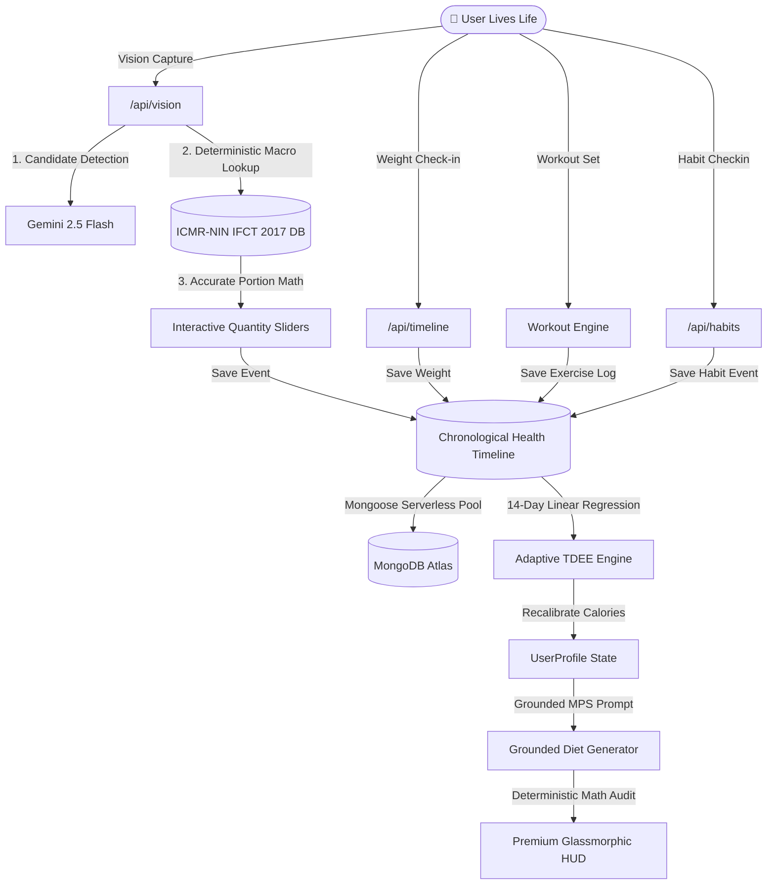

<div align="center">

# 🟢 Health OS

### *The World's Most Intelligent Personal Health Operating System*

[](https://github.com/AdityaThakur193/HealthOs/actions/workflows/ci.yml)
[](https://nextjs.org/)
[](https://www.typescriptlang.org/)
[](https://vitest.dev/)
[](https://www.mongodb.com/)
[](https://tailwindcss.com/)
[](LICENSE)

<p align="center">
  Reversing the health tracking paradigm from a manual logging diary into an <b>automated, adaptive decision engine</b>.
</p>

[Explore Features](#-core-architectural-pillars) • [System Overview](#-system-architecture-overview) • [Architecture Specs](ARCHITECTURE.md) • [API Documentation](API.md) • [Getting Started](#-quickstart--setup) • [Contributing](CONTRIBUTING.md)

</div>

---

## 🚀 System Architecture Overview

Health OS decouples raw data collection from decision intelligence. All user actions (meal captures, workout completions, weight check-ins, sleep logs, habit check-ins) write to a unified, immutable **Health Timeline**. Downstream analytics engines process this timeline to adapt metabolic expenditure, fine-tune workout progressive overload, and audit nutritional intake.



---

## ⚡ Core Architectural Pillars

### 1. 14-Day Adaptive TDEE Expenditure Engine (MacroFactor Paradigm)
- **Problem**: Static BMR formulas (Harris-Benedict, Mifflin-St Jeor) ignore metabolic adaptation, NEAT variance, and sodium water retention.
- **Engine Solution** (`src/lib/tdee.ts`): Computes a 14-day rolling window linear regression of daily weight change vs average caloric intake.
- **Math Integrity**: Features water weight spike clamping (clamping max daily TDEE shift to ±200 kcal/day) and boundary safety limits `[1,200 kcal, 4,500 kcal]`.

### 2. 4-Stage Perfect Vision & ICMR-NIN IFCT 2017 Portion Engine
- **Problem**: Standard LLM vision APIs output text token-by-token and hallucinate macro math (e.g. claiming thin mess dal has 20g protein).
- **Engine Solution** (`src/lib/ifctData.ts` & `src/lib/gemini.ts`):
  1. **Visual Contract**: AI vision detects dish names and unit counts without guessing raw calories.
  2. **IFCT 2017 Database**: Post-processes dish detections against official **ICMR-NIN IFCT 2017** benchmarks (Rotis, Thin Mess Dal, Rice, Curd, Paneer, Whey, Eggs).
  3. **Interactive Quantity Sliders**: Replaces vague `Small/Medium/Large` buttons with real-time `-` / `+` portion controls (`1 Katori`, `2 Pieces`, `1 Scoop`).
  4. **Self-Learning Memory**: Adapts to individual hostel mess portion sizes over time.

### 3. Grounded AI Diet Generator with MPS Leucine Protein Spacing
- **Engine Solution** (`src/lib/dietEngine.ts` & `/api/diet/generate`):
  - Pre-calculates 4-meal Muscle Protein Synthesis (MPS) leucine protein distribution (25% Breakfast / 30% Lunch / 15% Evening Snack / 30% Dinner).
  - Calculates exact required additions (Whey Protein, Egg Whites, Boiled Eggs, Paneer, Curd, Chicken Breast) based on user preference (`veg`, `eggetarian`, `non_veg`).
  - Executes `auditAndFixDietPlanMath` to re-sum meal items in TypeScript and override any LLM arithmetic errors (**0% error rate**).

### 4. Evidence-Based Gym Engine & Progressive Overload
- **Engine Solution** (`src/lib/workoutPlans.ts`):
  - Supports 3-day, 4-day, 5-day, and 6-day training splits.
  - Implements double progression logic: automatically calculates target weight increases (+2.5kg for compound / +2.0kg for isolation) when top rep targets are hit.
  - Curated YouTube exercise video timestamp links embedded directly into exercise cards.

### 5. Autonomous AI Coach Assistant & Real-Time Data Control
- **Engine Solution** (`src/components/CoachChatFAB.tsx` & `/api/coach/chat`):
  - Action-first agent capable of parsing natural language to directly log meals, steps, water, sleep, weight, and habits.
  - Interacts directly with the chronological MongoDB health timeline database.

### 6. Habit Tracker & Daily Discipline Engine
- **Engine Solution** (`src/lib/habitEngine.ts` & `/api/habits`):
  - Tracks daily health habits (hydration, sleep targets, prayer/meditation, physical activity).
  - Calculates active streaks (🔥) and completion percentages using EWMA exponential habit scoring.
  - Fully integrated with Coach AI so users can check off habits via natural voice/text commands.

---

## 📦 Quickstart & Setup

### Prerequisites
- **Node.js**: v18.0.0 or higher
- **npm**: v9.0.0 or higher
- **MongoDB**: Atlas instance or local MongoDB server

### 1. Clone & Install
```bash
git clone https://github.com/AdityaThakur193/HealthOs.git
cd HealthOs
npm install
```

### 2. Environment Configuration
Create a `.env.local` file in the root directory (refer to `.env.local.example`):

```env
MONGODB_URI=mongodb+srv://<username>:<password>@cluster0.mongodb.net/healthos
GEMINI_API_KEY=your_gemini_api_key_here
GROQ_API_KEY=your_groq_api_key_here
```

### 3. Run Development Server
```bash
npm run dev
```
Navigate to [http://localhost:3000](http://localhost:3000).

### 4. Run Automated Test Suite
```bash
# Run TypeScript Strict Validation
npm run type-check

# Run Vitest Test Suite (35 Unit & Security Tests)
npm test
```

### 5. Build for Production
```bash
npm run build
npm run start
```

---

## 📂 Repository Layout Map

```
HealthOs/
├── .github/
│   ├── workflows/
│   │   └── ci.yml                # GitHub Actions CI Workflow (Lint, Type-Check, Test, Build)
│   ├── PULL_REQUEST_TEMPLATE.md  # Standard Pull Request Submission Template
│   └── ISSUE_TEMPLATE/           # Bug Report & Feature Request Issue Templates
├── public/                       # Static Assets & PWA Service Worker (sw.js)
├── src/
│   ├── app/                      # Next.js 16 App Router Pages & REST API Routes
│   │   ├── api/                  # Serverless API Endpoints (/vision, /diet, /timeline, /habits, etc.)
│   │   ├── meal/                 # AI Vision Meal Capture Page
│   │   ├── workout/              # Progressive Overload Workout HUD Page
│   │   ├── habits/               # Habit Tracker & Streak Dashboard Page
│   │   ├── review/               # Sunday Weekly Review Page
│   │   └── page.tsx              # Main Glassmorphic Dashboard HUD
│   ├── components/               # Reusable Glassmorphic UI Components
│   ├── hooks/                    # Custom React Hooks (useConfirmDialog, useAuthGuard, etc.)
│   ├── lib/                      # Core Engineering Algorithms
│   │   ├── tdee.ts               # 14-Day Adaptive TDEE Expenditure Engine
│   │   ├── ifctData.ts           # ICMR-NIN IFCT 2017 Indian Food Database
│   │   ├── dietEngine.ts         # Grounded AI Diet Allocation & Math Audit Engine
│   │   ├── workoutPlans.ts       # Workout Split & Progressive Overload Engine
│   │   ├── habitEngine.ts         # Habit Tracker & Streak Analytics Engine
│   │   ├── gemini.ts             # Gemini 2.5 Flash Vision Integration
│   │   └── mongodb.ts            # Serverless Mongoose Connection Pool Cache
│   └── __tests__/                # Vitest Test Suites (35 Tests Passed)
├── ARCHITECTURE.md               # Technical Deep-Dive & Mermaid Flow Diagrams
├── API.md                        # Complete REST API Specifications
├── CONTRIBUTING.md               # Developer Contribution & Branch/Commit Standards
├── SECURITY.md                   # Vulnerability Reporting SLA & Security Specs
├── CHANGELOG.md                  # Release Version History
├── LICENSE                       # Official MIT License
└── package.json                  # Dependencies & npm Scripts
```

---

## 🧪 Automated Testing & Quality Audit

Health OS maintains an automated **Vitest** test suite covering 35 unit, integration, and security edge cases:

```
 RUN  v4.1.10 D:/HealthApp

 ✓ src/__tests__/security.test.ts (8 tests)
 ✓ src/__tests__/apiValidation.test.ts (4 tests)
 ✓ src/__tests__/tdee.test.ts (6 tests)
 ✓ src/__tests__/workoutPlans.test.ts (4 tests)
 ✓ src/__tests__/habitEngine.test.ts (5 tests)
 ✓ src/__tests__/ifctData.test.ts (4 tests)
 ✓ src/__tests__/dietEngine.test.ts (4 tests)

 Test Files  7 passed (7)
      Tests  35 passed (35)
```

---

## 📄 License & Attribution

Distributed under the **GNU Affero General Public License v3.0 (AGPLv3)** with mandatory author attribution. Anyone modifying, distributing, or hosting this software must preserve original credits acknowledging **Aditya Thakur** as the original author and keep derivative works 100% open-source under AGPLv3. See [`LICENSE`](LICENSE) for details.

Designed & Built with ❤️ by [Aditya Thakur](https://github.com/AdityaThakur193).
