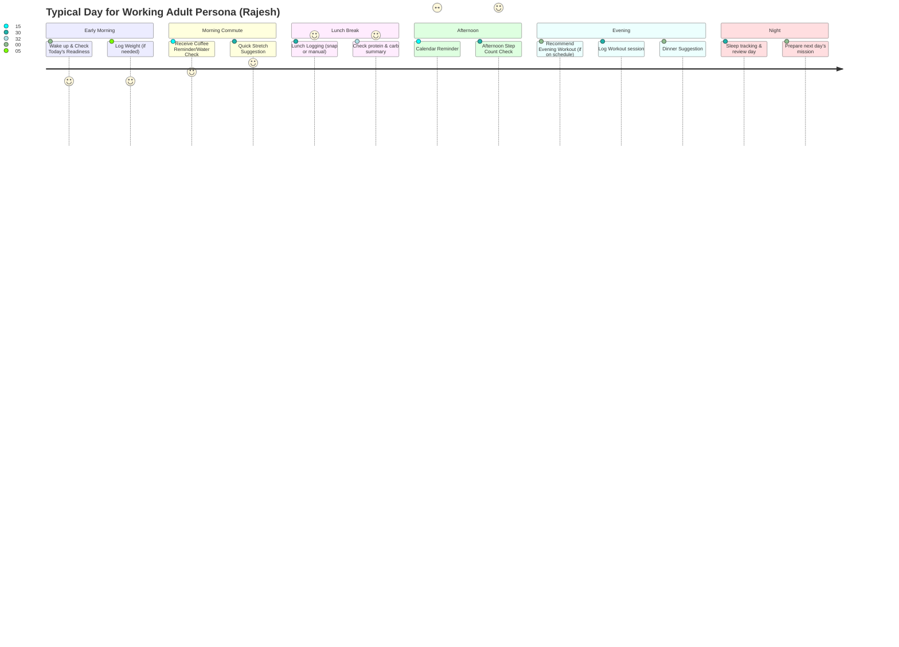
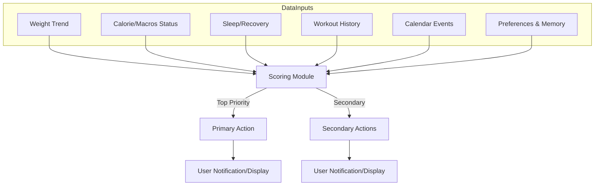
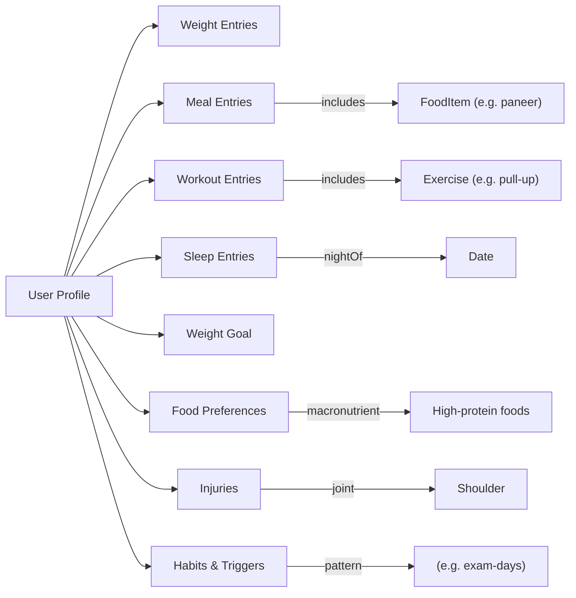

# Executive Summary  
Project Atlas is a “Health OS” – an AI-powered personal intelligence platform for health. This blueprint report outlines its design for a startup-ready implementation. We define **user personas** (with demographics, goals, pain points), map their **daily touchpoints** (hour-by-hour routines), and prioritize **features** into an MVP and future waves. We inventory every **screen** (each answering one key question) with primary actions and acceptance criteria. We detail **user flows** (onboarding, daily missions, meal/workout logging, recovery checks, calendar-aware planning, data export). Our **AI architecture** breaks the system into agents (Vision, Nutrition, Workout, Recovery, Memory, Planner, Coach) with clear inputs/outputs and uncertainty handling. We design the **Daily Decision Engine** (a scoring pipeline that ingests all data and outputs a ranked daily plan, with fallbacks and explainability). The **data model** is a time-series + graph of user events and preferences (entities like Users, Meals, Workouts, Goals, Events, etc.), illustrated by a mermaid memory graph. We list all relevant **APIs** (Apple HealthKit, Google Health Connect, Calendar, Location, Payments, wearables) in a matrix. We adopt an **offline-first strategy** (local storage as source-of-truth with opportunistic sync) and strict **privacy/data ownership** (user encryption, export/delete controls, on-device processing where possible). We propose **analytics/metrics** (retention, engagement, advice acceptance, NPS, A/B tests). We sketch a 4-month **roadmap** (Milestones, sprints, roles, timelines). We set **MVP acceptance criteria** (e.g. user can log meals/workouts and see a personalized “Daily Mission”, with X% task completion). We summarize **UX design principles** (accessibility, motion, simplicity) and **edge cases** (AI failure, no-sensor data, permission revocation). Finally, we outline a **launch plan** (private beta, feedback loop, growth channels) and **risks** (platform competition, data liability) with mitigations. This blueprint is intended to guide engineers/designers to build the product without ambiguity.

# 1. User Personas  
We define **3–4 personas** representing target users. (User personas are fictional yet research-based profiles to capture goals and pain points.)

| Persona             | Demographics                  | Goals                                | Pain Points                                                  |
|---------------------|-------------------------------|--------------------------------------|--------------------------------------------------------------|
| **Young Student**   | Age 20–25; college; global    | Gain energy, manage stress, look fit | Busy schedule, limited budget, irregular meals, exam stress  |
| **Working Adult**   | Age 30–40; professional; India focus | Maintain weight, improve health, manage work/family balance | Long commute, sedentary job, irregular hours, stress, family commitments |
| **Health-Conscious Older Adult** | Age 55–65; retired/prof.; global | Manage chronic conditions, stay active, longevity | Limited tech skills, memory issues, multiple medications |
| **Fitness Enthusiast** | Age 20–35; gym regular; global | Optimize performance, track progress | Wants precision, gets bored with routine, high expectations |

- **Young Student:** Tech-savvy, values social aspects. Goals include energy, fitness and stress relief. Pain: irregular routine, exam stress disrupts habits.
- **Working Adult:** Busy lifestyle. Goals: weight control, consistent activity, stress management. Pain: commutes, long workdays, family duties leave little time for health.
- **Health-Conscious Older Adult:** Has health goals (e.g. manage blood pressure, maintain mobility). Pain: may forget tracking steps/meals, multiple doctor visits, needs simple guidance.
- **Fitness Enthusiast:** Experience tracker; uses gadgets. Goals: measurable gains (strength, endurance), personalized plans. Pain: plateau frustration, too many apps with raw data.

*(The above personas are examples; we assume global English-language users, with device constraints including mid-range Android (~₹15,000 phone) capability).*

# 2. Daily Life & Touchpoint Maps  
For each persona, we map a typical day and where they interact with the app. Below is one illustrative timeline (for the Working Adult) using a mermaid user-journey chart:  

Each persona will have variations (e.g. Student’s schedule includes class/club times; Older Adult’s includes medication reminders, gentle walks). The app touches occur at wake-up (daily plan), mealtimes (logging/checking goals), post-lunch (steps), evening (workout or walk), and bedtime (sleep analysis). These touchpoints guide the app’s **flows** below.

# 3. Feature Prioritization  

| Feature                           | MVP (Y/N) | Later (v1+) | Description                                                        |
|-----------------------------------|-----------|-------------|--------------------------------------------------------------------|
| **User Onboarding & Profile**     | Y         | –           | Sign-up, goals, biometrics (age, weight, fitness level)           |
| **Basic Daily Mission Display**   | Y         | –           | Home screen with today’s plan (one-liner mission list)            |
| **Manual Weight Logging**         | Y         | –           | Enter or sync weight; shows weight trend                          |
| **Step Tracking (Phone Sensors)** | Y         | –           | Use built-in pedometer, show steps and goal (no wearable needed)  |
| **Water Tracking**                | Y         | –           | Log water intake bottles/cups manually                             |
| **Calorie/Nutrition Logging**     | Y (basic) | v1+: Smart AI | Photo recognition + DB suggestions; initial manual fallback       |
| **Workout Logging**               | Y         | –           | Log sets/reps or activities, with basic library                   |
| **Basic Recovery Data**           | Y         | v1+: Advanced | Sleep tracking via phone or basic wearable (if available)        |
| **Daily Mission Engine (rules)**  | Y         | –           | Compute top action (e.g. “eat more protein”) using fixed heuristics|
| **Journey/Analytics Screen**      | Y         | –           | Show weight graph, streaks, key stats                              |
| **Insights/Coach Screen**         | N         | Y           | Detailed AI feedback, “why” behind suggestions                     |
| **Calendar Integration**          | N         | Y           | Read user events (meetings, travel) to adjust plan                |
| **Apple Health / Google Fit**     | N         | Y           | Data sync for steps, heart rate, weight, sleep |
| **Payment/Subscriptions**         | N         | Y           | In-app purchase or external payment integration                   |
| **Social Sharing / Community**    | N         | Y           | Optional sharing of milestones with friends                       |
| **Advanced AI Chatbot**           | N         | Y           | NLP chat for questions (“help me eat more protein”)              |

*MVP features (Y) are the core needed for a viable product. v1+ features are valuable enhancements.* For example, MVP supports manual nutrition entry (or basic photo logging); smart vision-based nutrition AI can improve later. Integration with platform health services (HealthKit, Google Fit) can come once basic app works.

# 4. Screen Inventory  

Each screen answers one main question. Primary actions and acceptance criteria (AC) ensure completeness.

| Screen                 | Single Question           | Primary Actions                          | Acceptance Criteria (AC)                                      |
|------------------------|---------------------------|------------------------------------------|---------------------------------------------------------------|
| **Onboarding/Profile** | Who are you? What are your goals? | Enter personal data (height, weight, age, goals); set preferences | AC: User can create account, set goal (e.g. weight loss) and baseline stats. |
| **Home / Today**       | What should I do today?  | View “Daily Mission” list; tap items to act; see readiness metric | AC: Shows clear daily plan (e.g. “Walk 2000 steps”). Readiness % visible. |
| **Nutrition / Meals**  | What have I eaten/should I eat? | Add meal (photo or manual); view daily macro progress; see suggestions | AC: Meal added updates calories; suggests foods if nutrient shortfall. |
| **Workout**            | What should I train today? or how did my workout go? | Start or log workout; select exercise; record sets/reps; view past workouts | AC: Workout can be logged or planned. Completed workouts record weight/reps. |
| **Journey/Progress**   | How am I changing?        | View trends (weight, strength, milestones); timeline of highlights | AC: Shows weight graph, charts of progress, one-highlight positive/neg. |
| **Coach/Insights**     | Why this advice/how am I doing? | Read AI-generated insights (e.g. “You improved sleep, great!”); Accept or query | AC: Provides explanatory feedback for daily plan; links to sources (if any). |
| **Calendar/Events**    | What events affect my plan? | Connect calendar; mark events (travel, exams); see adjusted plan | AC: Calendar sync on; events appear on timeline; adjusting plan accordingly. |
| **Settings/Profile**   | Who am I today? (Control) | View/edit personal data, connect devices, set privacy; export/delete data | AC: User data editable; export request generates file; permissions toggles. |
| **Error/Offline**      | —                         | Show notice (e.g. “Data saved offline”); retry or offline info           | AC: User informed about offline status; data will sync later. |

Each screen’s single question is its purpose. For example, the Home screen’s question is “What should I do today?” (displaying only mission tasks and readiness). The Nutrition screen’s question is “What have I eaten/should I eat?” and primary actions are adding meals (photo or text) and showing nutrient targets. We ensure **one primary action per screen** (Rule 5 from Constitution). Screens should not overwhelm: e.g. the Home screen should not show graphs—just “today’s mission” items.

# 5. User Flows  
We describe key end-to-end flows. (Diagrams are omitted in text, but flows are detailed.)

- **Onboarding Flow**: User creates account (or guest), enters profile (age/sex/height), goal (weight loss, etc.), default activity level. Optionally connect device (HealthKit/Fit). App computes initial calorie/protein targets. AC: after onboarding, user lands on Home with Day 1 plan.

- **Daily Mission Execution**: Each morning (or upon opening), the Daily Decision Engine generates a mission list (e.g. “Walk 3000 steps, eat 50g protein tonight, sleep by 11pm”). The home screen shows these tasks. User taps tasks to view details (e.g. opening Walk shows path tracking or step count). Completion of tasks (step count achieved, food logged) updates the engine.

- **Meal Capture Flow**: From the home or Nutrition screen, user chooses to log a meal. They can take a photo (Vision agent) or enter manually. The app uses on-device ML (Vision Agent) to identify foods (with confidence). It then estimates nutrients (Nutrition agent). The user reviews and confirms/corrects. Nutrient totals update daily progress.

- **Workout Session Flow**: From Home or Workout tab, user starts a workout. They select a routine or auto-schedule from Planner agent. During or after workout, user logs sets/reps (Workout agent records). Upon completion, Workout agent evaluates performance (e.g. added weight or reps) and feeds to Memory.

- **Recovery Check Flow**: App reads sleep data (if connected) or asks user for sleep hours. Recovery agent calculates readiness (using e.g. sleep, HRV). If user slept poorly, it might adjust workout intensity (via Planner). AC: poor sleep triggers lower mission difficulty next day.

- **Calendar-Aware Planning Flow**: User connects their Calendar. The Planner agent scans events (travel, exam) and flags “busy period”. It then adjusts upcoming missions (e.g. lighter workout during exam week). AC: Blocking out travel days, skip workouts or reduce calorie target.

- **Data Export/Delete Flow**: In Settings, user selects “Export Data” or “Delete Account”. Export packages personal metrics (CSV/JSON) for user's records. Delete erases account and data. AC: Exports prompt download; delete requires confirmation and fully wipes data (per privacy rules).

Each flow is guided by our principles (reduce steps, immediate feedback, one action). For example, meal capture via photo should take at most a few taps: “Add Meal > Snap Photo > Confirm” rather than manual calories entry.

# 6. AI Architecture (Agents)  
We split intelligence into specialized agents. Each agent ingests certain inputs and outputs recommendations or insights, handling uncertainty (low confidence) gracefully (Rule 7 and 9). 

- **Vision Agent**: **Inputs:** Meal image(s) from user. **Outputs:** Identified foods and quantities (with confidence). On low confidence, it asks user confirmation or falls back to manual input. Also can recognize environment (e.g. gym background) to autofill workout. *Role:* Translate camera input to data (see Nutrition agent).  

- **Nutrition Agent**: **Inputs:** Foods consumed, current nutrient totals, user goals (calorie, macro targets). **Outputs:** Remaining macros for day, meal suggestions. It updates nutrient intake and alerts (e.g. “Protein 20g short”). Handles uncertainty by giving ranges or “approximate” labels.  

- **Workout Agent**: **Inputs:** Planned workout routine, logged exercises (weight/reps), user strength stats. **Outputs:** Adjusted next workout plan, reps/weight progression. If data missing (user didn’t log one session), it repeats or gently pushes.  

- **Recovery Agent**: **Inputs:** Sleep duration/quality, HRV (if available), past fatigue reports. **Outputs:** Readiness score, recommendations (more sleep, light workout). On poor data (no sleep info), uses defaults.  

- **Memory Agent**: **Inputs:** All logged data and events over time. **Outputs:** User model (preferences, habits, injuries, triggers). E.g., it notes “Fri evenings user often eats pizza” or “stressful days lower step count”. Updates profiles like favorite foods, disliked exercises. Handles obsolescence by weighting recent data more.  

- **Planner Agent**: **Inputs:** User calendar/events, current schedule, trainer preferences. **Outputs:** Adjusted daily plans (e.g., move rest day around vacation). Integrates context (“tomorrow is exam; suggest stress-relief run”). Works with memory (e.g., if user hates morning gym, schedule PM).  

- **Coach Agent**: **Inputs:** Aggregated progress (weight trend, consistency, goal gap). **Outputs:** Long-term advice (“You’ve lost 2kg in 2 months, great job!”), encouragement. Also answers user queries (“What’s my fastest mile?”). Provides the “why” behind suggestions using evidence (Rule 8).  

Each agent uses AI/ML where needed (e.g. Vision uses image recognition model; Coach may use an LLM for language). However, **AI is used only where it adds value** (Rule 6). When in doubt, fall back to deterministic logic. The AI architecture is event-driven and modular: new agents (e.g. Mental Health Agent) could be added later. 

# 7. Daily Decision Engine Design  
The Daily Decision Engine is the core pipeline that produces the user’s **daily mission**. In simplified form:

- **Inputs:** At start of day (or upon app open), collect all data: recent weight trend, yesterday’s calorie balance, current macros, last night’s sleep (Recovery), recent workouts, upcoming calendar flags, user preferences (e.g. loves running).  
- **Scoring Module:** Applies weighted rules to rank possible actions. E.g.: if weight change > target, increase/decrease calories; if protein% < 80% this week, bump protein target; if steps fell short 3 days, include walk goal; if high stress forecast (via calendar), suggest relaxing activity. We combine **hard rules** (if weight rising while deficit, reduce deficit) and **soft scoring** (score each candidate action). The highest-score actions become “Primary”.  
- **Outputs:** The module outputs a ranked list of mission items (usually 1 primary, up to 3 secondary). Each item includes an explanation string (for the Coach screen) and a confidence score. If data is missing (e.g. no sleep info), default routines apply (e.g. assume normal sleep). 

**Explainability:** For each recommendation, we record the “reasoning trace”. For example: *“Increase calories by 150 kcal because your 2-week weight loss (−0.7kg/week) exceeds target (−0.5kg/week).”* These explanations feed into the Coach screen (per Rule 8).

**Fallback:** If no data or on first launch, we use generic defaults (e.g. 10k steps, 100g protein, standard maintenance calories). We then refine as data accumulates. The engine runs daily (or on demand) and always leaves the user with a clear “What’s one thing to do now?”

# 8. Data Model & Memory Graph  
We use a hybrid data model: a **time-series event log** plus a **knowledge graph** of user attributes. Core entities: **User**, **MealLog**, **WorkoutLog**, **BodyMeasurement**, **HealthEvent** (e.g. "exam"), **Goal**, **Preference**. Relationships capture time and context. 

- *Timeline Entities:* Each day has entries like weight, steps, meals, workouts, sleep. These are time-stamped and appended to the timeline. 
- *Memory Graph:* Over time we derive graph nodes (e.g. “FavoriteFoods: idli”, “Injury: left shoulder”, “Habit: breakfast skipping”). These link back to past events. This graph allows quick queries (e.g. “has user logged spinach often?”). 

Below is an illustrative Mermaid graph of the memory schema:

In this graph, the central **User** node links to logs and high-level nodes. For example, **MealLog** entries point to specific foods. **Habits** node might encode that exam-days correlate with low steps, used by the Planner. The schema is flexible: new event types (e.g. MoodLog) can be added. All data (especially health metrics) is stored securely, with metadata (source, timestamp).  

# 9. APIs & Integration Points  

We integrate external data where it saves user effort or enriches insight. Key integration points:

| Integration         | Data Types                       | Notes                                    |
|---------------------|----------------------------------|------------------------------------------|
| **Apple HealthKit** | Steps, Flights, Distance, Workouts, Nutrition, Sleep, Heart Rate, Mindfulness, etc. | Permission-based. Central iOS health store. Can read/write to sync data across iPhone/Watch (privacy controls per user). |
| **Google Health Connect / Fit** | Steps, Calorie expenditure, Workouts, Weight, Nutrition, Sleep, Heart Rate | The Google Fit APIs (deprecated) allowed logging/reading broad data. Developers should use Health Connect on Android (new unified platform) to access similar data. |
| **Calendar (Google/Apple)** | Events (meetings, travel, vacations) | Read only (with permission). Helps Planner avoid conflicts (e.g. skip workout on holiday). |
| **Location (GPS)**   | For mapping outdoor workouts (run/cycle routes) | Optional: If user consents, Core Location can map exercise routes. Not required for core MVP. |
| **Wearables**       | Heart rate, HRV, SpO2, Sleep stages (if any)** | Integrations for Apple Watch (via HealthKit) or WearOS via Health Connect. Initial MVP uses phone data only; wearables support in v1+. |
| **Payment (Stripe/Pay)** | Subscription purchase | In-app or external. Ensure compliance (e.g. use Google Play Billing, Apple In-App Purchase). |
| **Support/Help**    | Email/SOS contact | To escalate issues (not data integration). |

*Note:* Per Apple’s guidelines, any access to HealthKit data requires explicit user permission and a privacy policy. Similarly, use Health Connect APIs for Android. For now we assume generic integration plans; specific SDKs and authentication flows will be implemented during development.

# 10. Offline-First & Sync Strategy  
**Offline-first design:** The app’s local database is the “source of truth”. All user actions (logging meals, workouts, edits) write to local storage instantly. Network sync to the cloud (for backup and cross-device sync) happens opportunistically (e.g. on Wi-Fi or when convenient). This ensures usability in low-connectivity scenarios (important for markets like rural India).  

- **Local DB:** Use an encrypted embedded database (e.g. SQLite/Room on Android, Core Data on iOS) to store all user data (logs, profile, memory graph).  
- **Sync:** Implement a background sync service (Android WorkManager / iOS background tasks) that batches changes. Conflicts (e.g. same record edited offline on two devices) resolve via “last-write-wins” or by prompting the user.  
- **UI:** The app should function fully offline: user can view history, log new items, see “today’s plan” (based on last sync data). If offline, show a banner “Offline: data will sync when connected.” All writes are queued.  
- **Backup:** Periodically (user opt-in), data is encrypted and backed up to cloud (e.g. Firebase, or proprietary server) for restore on new device.  

This strategy aligns with best practices: “make local data the source of truth, sync opportunistically”. It also conserves battery/data by deferring syncs. The UI indicates sync status and handles failures gracefully (e.g. retry, user manual sync).

# 11. Privacy & Data Ownership  
We give **full ownership** of health data to the user (Rule 7). Key points:

- **Consent:** Users explicitly opt-in for data collection (during onboarding or when using a feature). We explain why (e.g. location used to map runs). Permissions can be revoked anytime.
- **Export/Delete:** Users can export all their data (e.g. to CSV/JSON) or request account deletion. Deletion must fully wipe their data (per GDPR-like principles). We comply with standards: e.g. Apple states users can revoke any app’s HealthKit permissions or delete data anytime. We will match this (AC: deletion button removes data from device and server).
- **Encryption:** All personal health data is encrypted at rest and in transit (HTTPS for server). We use strong device encryption (AES-256). Following Apple’s model, we ensure health records on our server are only decryptable by the user (if cloud backup is used). No plaintext health data on server.
- **Minimal Data Sharing:** Data is used only to provide service. We do NOT sell personal data. Aggregated anonymous usage stats may be collected for analytics (opt-in).
- **HIPAA/GDPR Compliance:** Although this is a consumer app, we adhere to privacy best practices. For example, Apple’s iOS Health data sync is HIPAA-compliant for healthcare provider shares; similarly, we will treat user data with equivalent security if sharing with any health partner. 
- **Local Processing:** To maximize privacy, core features (like Vision recognition) run on-device if possible (using on-device ML). Only non-identifiable summaries (e.g. nutrient totals) need syncing.

By design, the user “owns” their data. They can always retrieve or remove it. Like Apple’s HealthKit rules, they keep control. This builds trust (non-negotiable) and meets legal standards.

# 12. Analytics & Success Metrics  
We will track product analytics (with user consent, anonymized) to measure engagement and effectiveness. Key metrics:

- **Usage & Retention:** DAU/WAU/MAU, Day-1/7/30 retention. A successful health app often tracks 30% Day-30 retention or better in engaged cohorts.  
- **Task Completion Rate:** Fraction of missions completed each day (e.g. user drinking recommended water, completing suggested workout). High completion implies value.  
- **Habit Formation:** Percentage of users who maintain daily use for 4+ weeks.  
- **Engagement:** Average session length (target ~2–5 min), number of sessions/day (optimal: 1–2 check-ins). *Important:* low friction means *short* sessions, not high screen time.  
- **Advice Acceptance/Trust:** Measure how often users follow suggestions vs override them. For example, if the app suggests “eat protein tonight” and user logs the protein, that’s acceptance. Use surveys (NPS or usability) and net promoter score to gauge trust.  
- **A/B Tests:** We’ll iterate UX and AI. For example, A/B test wording of suggestions, or the impact of adding a gamified streak on retention. Track differences in completion/retention.  
- **Health Outcomes (long-term):** Average weight change or consistency score over 3 months (goal: positive outcome). Ultimately the KPI is “users are healthier” (e.g. X% meeting their weight or fitness goals).

These metrics align with startup analytics best-practices (e.g. Pirate metrics: Acquisition, Activation, Retention, Revenue). We will instrument events for every action (meal logged, workout started, mission displayed, etc.) to analyze funnels. Importantly, **“trust metrics”** like repeat usage after a personalized suggestion are monitored—since trust is core.

# 13. Engineering Roadmap (4 Months)  
We propose an aggressive 4-month sprint plan with a small cross-functional team (1 product lead, 1 designer, 2 mobile engineers, 1 backend, 1 AI/ML, 1 QA). 

| Milestone    | Duration (wks) | Key Deliverables                                              | Team Roles        |
|--------------|----------------|---------------------------------------------------------------|-------------------|
| **Setup & Design** | 2          | Complete product spec, UI prototypes, design system (colors, typography, components). Finalize data model and API schemas. | All (PM, Designer, Tech leads) |
| **Auth & Profile** | 1          | User accounts, onboarding screens, profile setup, local DB schema. | Mobile dev, Backend |
| **Home Screen & Daily Mission** | 2 | Implement Home/Today UI, “Daily Mission” list (static rules). Basic backend support for tasks. | Mobile dev, Backend |
| **Meal & Nutrition** | 2 | Meal log UI + backend (image API stub/mock), manual logging flow. Nutrient tracking logic. | Mobile dev, AI(vision stub), Backend |
| **Workout** | 2 | Workout logging UI & logic. Predefined exercise list, reps input, storage. | Mobile dev, Backend |
| **Recovery & Steps** | 1 | Integrate phone step counter, basic sleep input form, show recovery status. | Mobile dev |
| **Basic Analytics/Journey** | 1 | Weight chart, streak counters. Show some insights (e.g. “You gained X kg this week”) with static text. | Mobile dev, AI(stub feedback) |
| **AI Integration** | 4 | Replace stubs: Vision model for food, Nutrition logic API, basic Recovery algorithm (e.g. HRV if available), Memory data aggregation. Build simple Coach text generation (fixed templates). | AI/ML, Mobile dev, Backend |
| **Sync & Offline** | 2 | Implement offline database syncing, encryption, conflict logic. Test in flight/offline. | Mobile dev, Backend |
| **Beta Testing & Polish** | 4 | Internal QA, bugfixing, UX polish, A/B test setup, analytics hook-up. Private beta with select users (friends/family). Gather feedback. | All |
| **Launch Prep** | 2 | App store prep, marketing materials, press kit, beta feedback integration. | PM, Designer |

*(Weeks are overlapping; some teams work in parallel sprints.)* By 4 months we aim for a private beta. Each milestone has clear acceptance (e.g. “User can log a meal and see nutrient summary” or “Daily Mission list updates based on new weight entry”). Agile ceremonies (sprints, demos) keep progress on track.

# 14. MVP Acceptance Criteria & Test Plan  
We define criteria for MVP readiness (each is testable by QA):

- **Account Creation:** New user can sign up, set goal, and reach home screen. (Test: create account with data, see daily mission page.)  
- **Daily Mission:** Home screen shows at least one recommendation (step goal or nutrition). It updates next day based on previous input. (Test: log weight and food, restart app, see new mission.)  
- **Meal Logging:** User can add a meal (via photo or text) and the app shows updated calories/protein. (Test: take photo of lunch, confirm or edit, see nutrient totals.)  
- **Workout Logging:** User can add a workout, selecting an exercise and entering reps/weight. Logged workout appears in “Journey”. (Test: log 3 reps of pull-ups, see history updated.)  
- **Step Counter:** The app shows current step count and goal. (Test: walk some steps, open app, see count.)  
- **Weight Logging:** User can log daily weight. Weight graph on Journey reflects entries. (Test: log weight 70kg, see trend chart.)  
- **Data Persistence:** Data persists across app restarts (including offline scenario). (Test: enter data offline, restart, ensure data still present; sync after reconnect.)  
- **Data Export/Delete:** User can export data file and delete account fully (account removal confirmed).  
- **Performance:** Screens load <2s on test device (₹15k Android).  
- **Stability:** No crashes on core flows (meal, workout, mission).  

User testing: Recruit 5–10 beta users (one per persona type). Give them tasks (e.g. “Log a meal, view daily plan, log a workout, delete your account”). Success thresholds: ≥80% task completion with <2 errors, and subjective rating ≥4/5 for ease-of-use on surveys. Iterate if metrics are not met.

# 15. UX Principles & Design System  
Our UX follows the Constitution guidelines: **simplicity, single focus, trustful tone**. Design must be consistent and accessible.

- **Design System:** We define brand colors (calming blues/greens), typography (legible sans-serif), and reusable components (cards, buttons, forms). Motion is subtle: e.g. smooth transitions between screens, animated checkmarks on task completion. Components are one-handed (bottom nav), with key actions reachable by thumb.  
- **Accessibility:** Follow WCAG 2.1 AA. All text meets 4.5:1 contrast. Dynamic type / text scaling supported. Buttons have at least 44x44pt target (≈9mm). Important: use semantic labels, support screen readers (e.g. label icons).  
- **Layout:** Use Material Design (Android) and iOS HIG patterns. The Home screen has a clear header (“Today’s Mission”) and a card/list of tasks. Navigation bar icons: Home, Nutrition, Workout, Journey, Coach.  
- **Feedback:** Provide immediate feedback on user actions (e.g. checkmarks, snackbars). On errors (e.g. image recognition fail), show helpful message (“Couldn’t recognize food, please retry.”).  
- **Localization:** Design to accommodate different languages (English first, but leave room for text expansion). Indian context: ensure UI fits Indian date format and slang (e.g. “step goals” vs “daily walk”).  
- **Data Visualization:** Graphs (weight trend, macronutrient rings) are simple, not cluttered. Avoid overload – the Journey screen highlights only key facts (“You lost 2 kg since last month!”).  
- **Privacy Prompts:** Align with Apple/Android guidelines for requesting permission: provide context before the system prompt. If a feature is disallowed (GPS off), show reason.  

These UX rules (e.g. one screen = one question) are drawn from the product philosophy (Chapter 3) and accessibility best practices.

# 16. Edge Cases & Failure Modes  
We anticipate the following and plan mitigations:

- **AI Errors (Vision):** If food image is unrecognized or “low confidence”, fallback to manual logging. Show “low confidence” warning; user can edit or skip. The Nutrition agent uses ranges (“~400 kcal”) if exact is unclear.  
- **Missing Sensors:** If no wearable or if permission denied, we may not have HR or sleep data. In that case, Recovery agent uses default sleep assumption and still shows plan (perhaps with a prompt “how well did you sleep?”). If step sensors off, default to simple time-based goals.  
- **Permission Revoked:** If user disables Health/Location permission mid-use, we degrade gracefully (just stop importing that data, inform user). Example: user revokes HealthKit – app will show local tracking only. We keep working offline.  
- **Network Loss:** As per offline strategy, the app queues actions. On total data loss (bug), user always has local copy (backup on-device).  
- **Data Anomalies:** If user enters unrealistic values (e.g. 20kg weight), validations catch it. Outlier detection (like sudden 10kg jump) might prompt “are you sure?” to avoid skewing the engine.  
- **Conflicting Goals:** If user sets contradictory goals (gain & lose weight), the system alerts and asks to clarify.  
- **Privacy Attacks:** All inputs (photos) are processed locally; no image leaves the device. In case of server breach, encrypted data ensures no health info leak.  
- **Platform Policy:** Must comply with Apple’s HealthKit rules (no selling data). If policy changes (e.g. Google Fit deprecation), we adjust (we plan Health Connect ahead).  

In all cases, we default to transparency: error messages explain what happened and how to proceed.

# 17. Launch Plan  
- **Private Beta:** Release to ~50 testers (mixture of personas) via TestFlight/Google Beta. Collect feedback on onboarding, accuracy of daily mission, any frustrations. Offer incentive (free premium).  
- **Feedback Loop:** In-app feedback form + analytics. Weekly sprints to triage issues from beta. Possibly iterate UI (A/B test a greeting message or onboarding text).  
- **Public Launch:** Once stable, launch on app stores. Messaging: “Your personal health assistant — one touch, daily plan.” Emphasize AI-driven simplicity.  
- **Growth Channels:** For English-speaking/global: Tech blogs, fitness communities (Reddit, forums). For India: partner with local gyms/influencers, digital ads in health contexts. Universities might be pilot customers.  
- **Marketing:** Provide free trial of premium features (e.g. advanced insights). Gather testimonials. Encourage referrals (“share your success story”).  
- **Support:** Early on, hand-hold users (tutorial overlays explaining screens). Provide FAQ and Chat support to build trust.  

This phased approach allows refining the product. Private beta focuses on functionality; public launch focuses on scaling user base.

# 18. Risks & Mitigation  
- **Platform Competition:** Apple and Google have deep pockets and may build AI health features (e.g. Apple’s Health team). *Mitigation:* We focus on personalization beyond raw data. Our “intelligence engine” differentiator (trustworthy recommendations) is harder to replicate. We emphasize our unique daily planning (not just charts). Also, multi-platform (iOS+Android) reach, including India.  
- **Data Liability:** Storing health data carries liability (if a user relies on advice and is harmed). *Mitigation:* Include disclaimers (“not a medical device”), follow HIPAA-like security. Prioritize local processing. Ensure we follow region regulations (HIPAA in US, GDPR in EU/IND).  
- **AI Mistakes:** If AI gives bad advice (e.g. misreading food), user could lose trust. *Mitigation:* Display confidence and allow easy correction (Rule 2,8). We never say “guaranteed”, only “suggested”. Training data biases will be continuously reviewed.  
- **Privacy Backlash:** Any breach would destroy trust. *Mitigation:* Zero-sell policy, strong encryption, regular audits. Given Apple/Google’s emphasis on privacy, we align with those standards.  
- **User Adoption:** If the app requires too much initial effort, users may churn. *Mitigation:* Onboarding must show quick value (e.g. immediate mission). We may seed initial data (e.g. pre-fill some common meals) to reduce friction.  
- **Technical Complexity:** Building all AI features is hard. *Mitigation:* Use open-source/Cloud ML wisely, start simple (rule-based engine, local ML model for vision). Avoid over-complicating MVP.  

By planning for these, the team can prioritize trust (Chapter 2’s focus) and maintain a clear roadmap even if pivots are needed.

---

*Sources:* Apple and Google developer guides provide APIs for health data. Offline-first app design guides emphasize local storage as source-of-truth. Apple’s privacy policy highlights user control over health data. User persona methodologies are standard UX practice. (Other design and product principles are drawn from UX best practices and our product vision.)